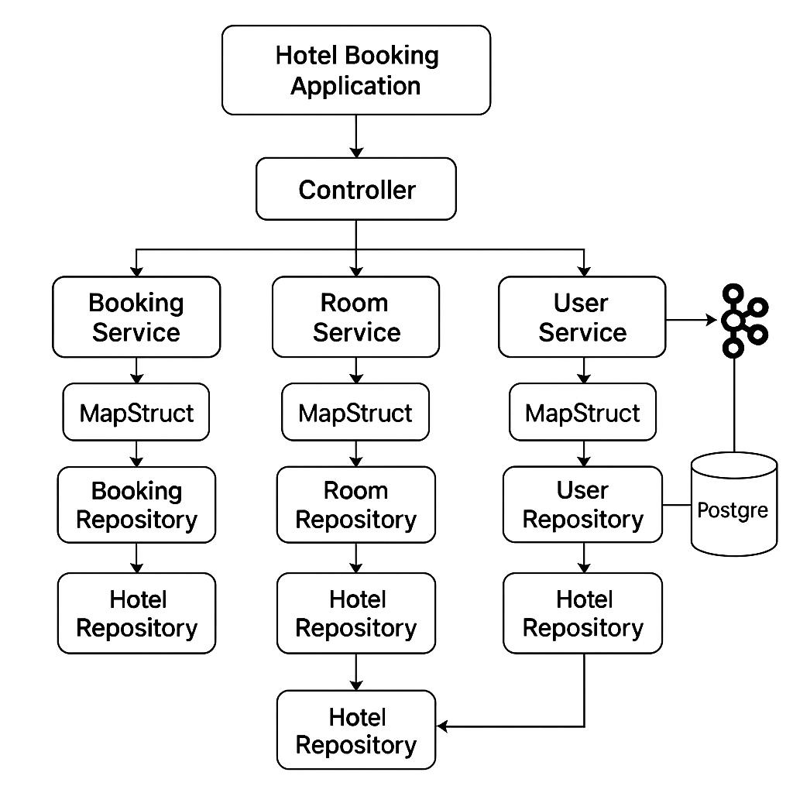

# Hotel Reservation System

Spring Boot-приложение для бронирования отелей. Поддерживает регистрацию и авторизацию пользователей, а также управление бронированиями через REST API.

## Функциональность

- Регистрация и авторизация пользователей (Spring Security)
- Разграничение ролей: клиент и администратор
- CRUD-операции для бронирований
- Встроенная H2 база данных
- REST API с использованием Spring MVC

## Стек технологий

- Java 17+
- Spring Boot
- Spring Data JPA (Hibernate)
- Spring Security
- H2 Database
- Maven
- Lombok

## Установка и запуск

### Требования

- Java 17+
- Maven

### Клонирование репозитория

```bash
git clone https://github.com/workjava9/example-hotel-reservations.git
cd example-hotel-reservations 
```


```bash
   mvn spring-boor:run
   ```

Доступ к функционалу приложение:
http://localhost:8080/swagger-ui/index.html

                                                         Архитектура проекта:


